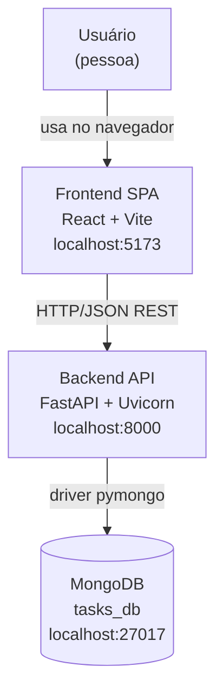
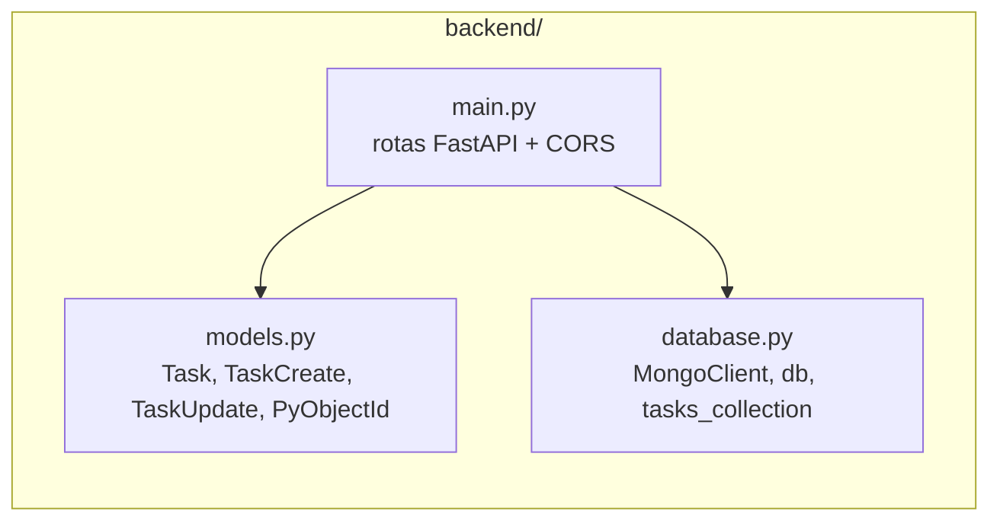

# Arquitetura

Documentada em níveis C4 (Contexto → Container → Componente), método padrão da indústria para descrever arquitetura de software em camadas de zoom crescente (Simon Brown, C4 Model).

## Nível 1 — Contexto

## Nível 2 — Containers

| Container | Tecnologia | Porta | Responsabilidade |
| --- | --- | --- | --- |
| Frontend SPA | React 19 + Vite 8 + axios | 5173 (dev) | Renderiza UI, chama a API, gerencia estado local (`useState`/`useEffect`) |
| Backend API | FastAPI 0.104+ + Uvicorn | 8000 | Expõe REST CRUD, valida payloads (Pydantic), converte para/de MongoDB |
| Banco de dados | MongoDB (local via winget) | 27017 | Persiste coleção `tasks` no database `tasks_db` |

Comunicação: Frontend → Backend é síncrona via HTTP/JSON (sem streaming, sem WebSocket). Backend → MongoDB via `pymongo.MongoClient` síncrono (sem pool assíncrono nativo — FastAPI é async, mas as chamadas ao Mongo neste projeto são bloqueantes; ver risco R-002 em [decisoes.md](decisoes.md)).

## Nível 3 — Componentes (Backend)

- **`main.py`** — define o `FastAPI()` app, middleware CORS, e todas as rotas (`/`, `/health`, `/api/tasks*`). Não há camada de service/repository separada: as rotas chamam `tasks_collection` diretamente (acoplamento aceito para o tamanho atual do projeto — ver AD-005).
- **`models.py`** — schemas Pydantic v2. `PyObjectId` é um tipo customizado que faz a ponte entre `bson.ObjectId` (Mongo) e `str` (JSON/HTTP). `TaskBase` → `TaskCreate`/`Task` (herança), `TaskUpdate` é independente com todos os campos opcionais (permite `PATCH` parcial via `exclude_unset=True`).
- **`database.py`** — inicializa o `MongoClient` no import do módulo (carrega `.env` via `python-dotenv`), testa a conexão com `ping` e falha rápido (`raise`) se o Mongo não estiver acessível.

## Componentes (Frontend)

| Arquivo | Responsabilidade |
| --- | --- |
| `frontend/src/api.js` | Cliente HTTP único (axios), concentra `baseURL` e todas as chamadas REST (`listTasks`, `createTask`, `updateTask`, `deleteTask`) |
| `frontend/src/App.jsx` | Único componente da aplicação: estado (`tasks`, `title`, `description`, `error`), efeitos (`loadTasks` no mount) e handlers (submit/toggle/delete) |
| `frontend/src/App.css` / `index.css` | Estilos |

Não há roteador (`react-router`), não há gerenciador de estado global (Redux/Zustand) — estado 100% local ao componente único, consistente com o escopo Small do MVP.

## Stack consolidada

| Camada | Tecnologia | Versão (requirements.txt / package.json) | Versão real instalada (STATE.md) |
| --- | --- | --- | --- |
| Backend framework | FastAPI | 0.104.1 | 0.141.1 |
| ASGI server | Uvicorn | 0.24.0 | 0.52.4 |
| Driver MongoDB | PyMongo | 4.6.0 | 4.17.0 |
| Validação | Pydantic | 2.5.0 | 2.13.5 |
| Config | python-dotenv | 1.0.0 | 1.0.0 |
| Banco | MongoDB Server | — (local, winget) | 8.3.7 |
| Frontend framework | React | ^19.2.8 | — |
| Build tool | Vite | ^8.2.2 | — |
| HTTP client | axios | ^1.20.0 | — |
| Lint | oxlint | ^1.79.0 | — |

**Nota de deriva de versão:** `requirements.txt` fixa versões de 2023/2024, mas o ambiente real (STATE.md) já rodava versões 2025+. Isso é uma divergência de reprodutibilidade — registrar como risco (R-003) até `requirements.txt` ser atualizado com `pip freeze`.

## Estilo arquitetural

- **Padrão:** Monólito simples de 2 camadas (API + DB) servindo uma SPA — sem gateway, sem microsserviços, sem fila de mensagens.
- **Justificativa:** proporcional ao escopo MVP (single-user, sem carga, sem times múltiplos). Ver [ADR AD-003](decisoes.md#ad-003-framework-backend).
- **Ponto de evolução esperado:** se autenticação/multiusuário for adicionado, introduzir camada de serviço/repositório entre rotas e `tasks_collection` para isolar regras de negócio (hoje inexistente).
