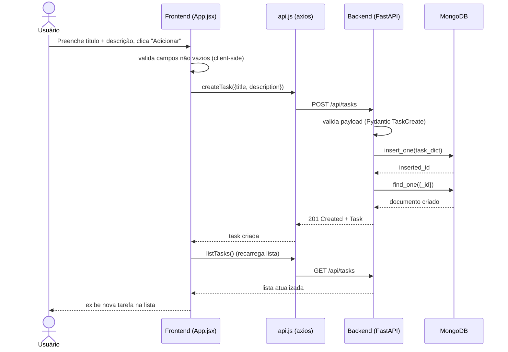
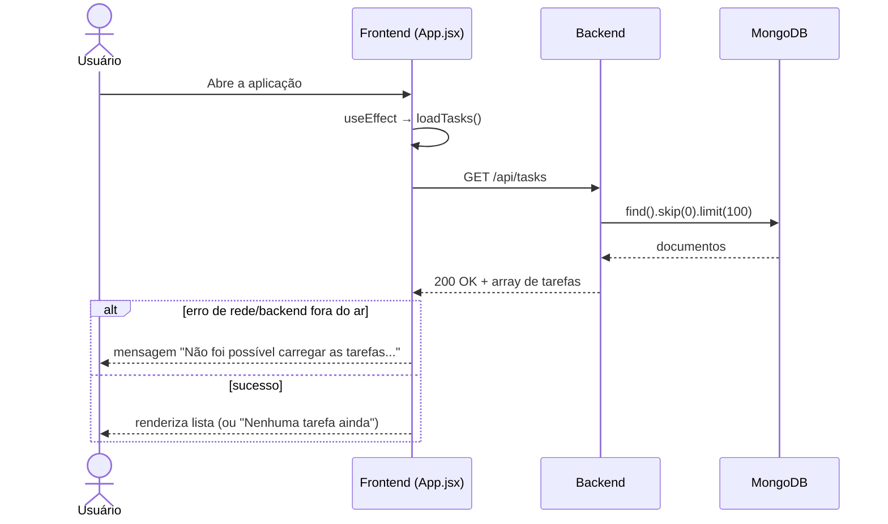
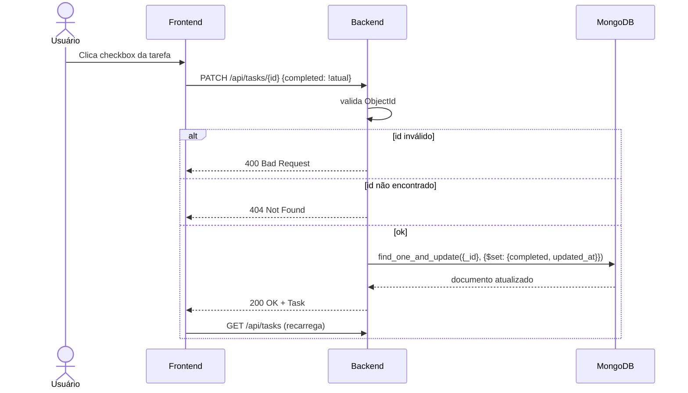
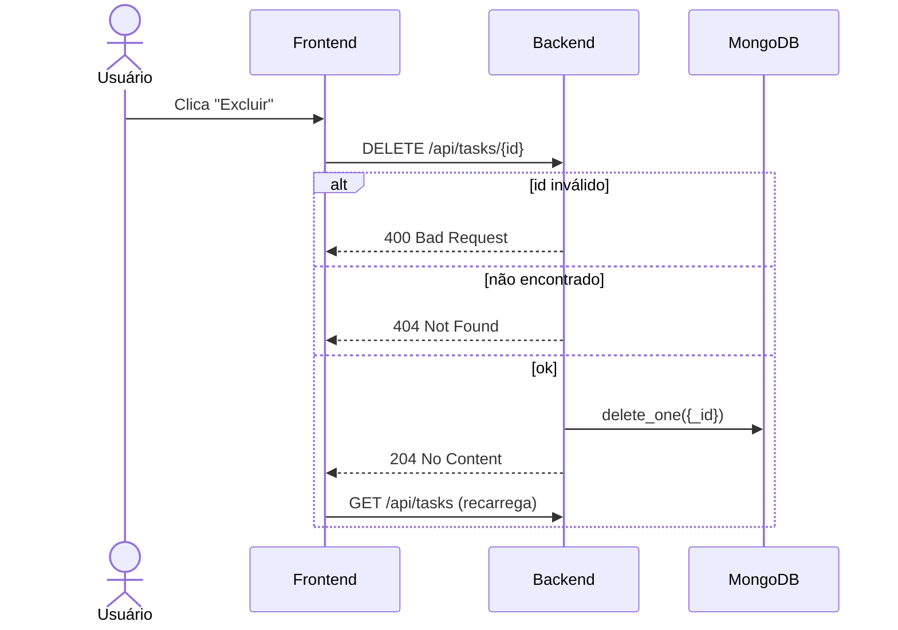
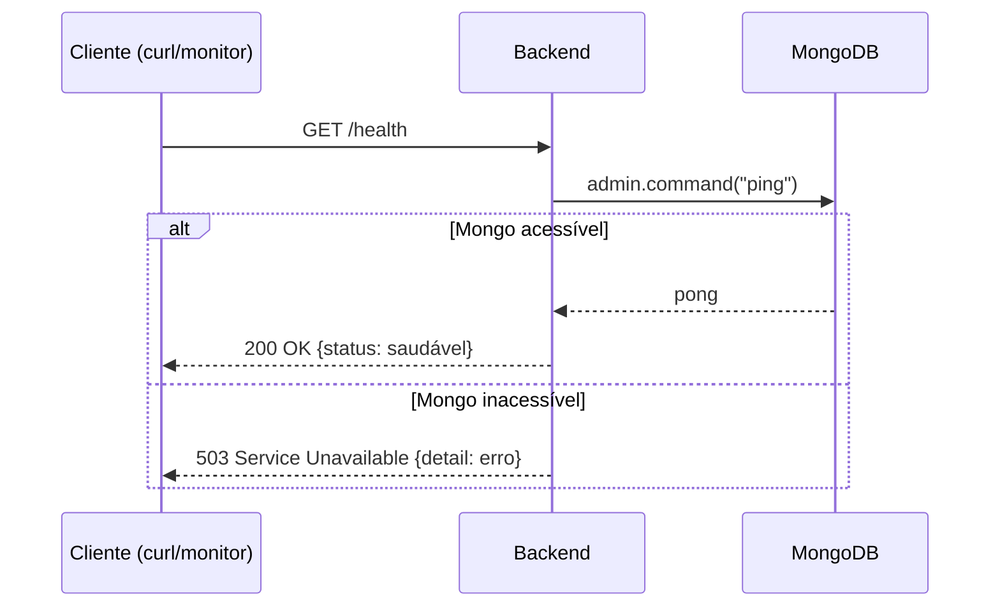

# Fluxos

Diagramas de sequência (Mermaid `sequenceDiagram`), padrão UML, para os fluxos observáveis do sistema. Cada fluxo referencia o REQ correspondente em [requisitos.md](requisitos.md).

## Fluxo 1 — Criar tarefa (REQ-001, REQ-007)

## Fluxo 2 — Listar tarefas ao carregar a página (REQ-002, REQ-007)

## Fluxo 3 — Concluir/reabrir tarefa (REQ-004, REQ-007)

## Fluxo 4 — Excluir tarefa (REQ-005, REQ-007)

## Fluxo 5 — Health check (REQ-006)

