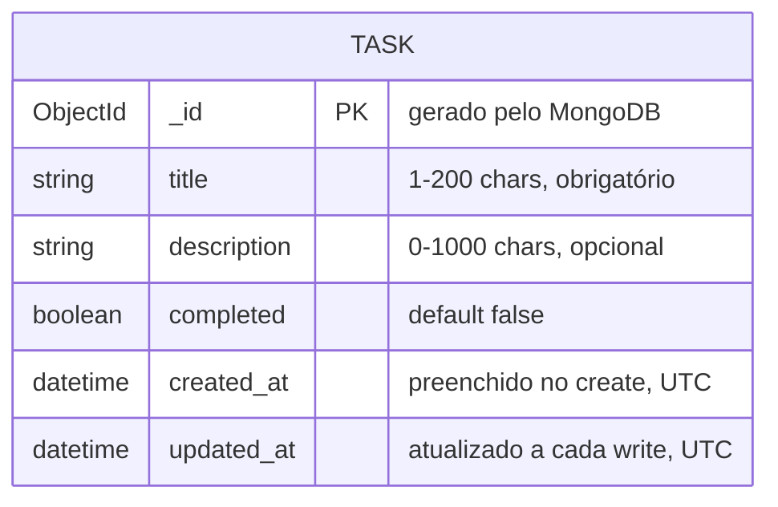

# Modelo de Dados

Notação ER (Entity-Relationship) em Mermaid `erDiagram`, padrão de mercado para modelagem conceitual de dados independente do SGBD.

Coleção única no MVP atual: `tasks` (database `tasks_db`). Não há relacionamentos (sem usuários, categorias ou tags ainda) — schema flat intencional para o escopo Small.

## Campo a campo

| Campo | Tipo (Mongo) | Tipo (Pydantic) | Regras |
| --- | --- | --- | --- |
| `_id` | ObjectId | `PyObjectId` (custom, serializa para `str` no JSON) | Gerado automaticamente, imutável |
| `title` | string | `str` | `min_length=1`, `max_length=200`, obrigatório em create |
| `description` | string \| null | `Optional[str]` | `max_length=1000`, opcional |
| `completed` | boolean | `bool` | Default `False` |
| `created_at` | ISODate | `datetime` | Preenchido no servidor (`datetime.utcnow()`), não editável via API |
| `updated_at` | ISODate | `datetime` | Atualizado no servidor em toda escrita (create/update) |

## Schemas de request/response (Pydantic)

- **`TaskCreate`** = `TaskBase` (`title`, `description`, `completed`) — usado em `POST /api/tasks`.
- **`TaskUpdate`** — todos os campos opcionais (`title`, `description`, `completed`) — usado em `PATCH /api/tasks/{id}`, aplica `exclude_unset=True` para não sobrescrever campos não enviados.
- **`Task`** — schema completo de resposta (`TaskBase` + `id`, `created_at`, `updated_at`) — retornado em todos os endpoints de leitura/escrita.

## Índices

Nenhum índice explícito é criado hoje além do `_id` padrão do MongoDB. Se a coleção crescer ou filtros por `completed`/`title` forem adicionados à listagem, considerar índice em `completed` (ver risco R-004 em [decisoes.md](decisoes.md)).

## Regras de integridade aplicadas na camada de aplicação (não no banco)

MongoDB não impõe schema por padrão — toda validação (`min_length`, `max_length`, tipos) acontece em `models.py` via Pydantic **antes** da escrita. Isso significa que documentos inseridos fora da API (ex.: via `mongosh` diretamente) não são validados.
